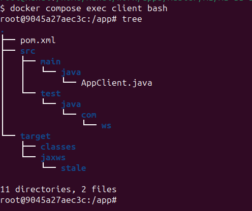
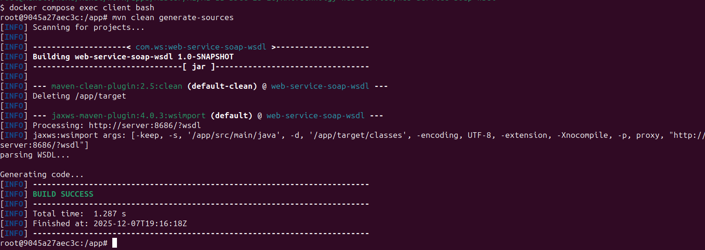
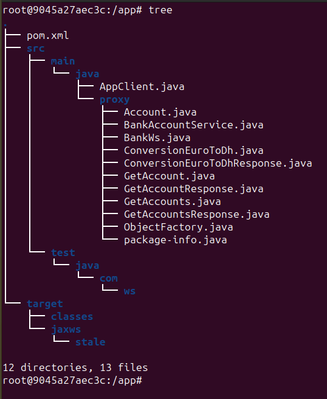

<h1>Projet SOAP – (Serveur  & Client ) Java avec Docker</h1>

Ce projet démonstre la mise en place d’un Web Service SOAP en Java (JAX-WS), son test via WSDL, puis sa consommation à partir d’un (Soap-ui & client Java), le tout avec Docker.

<h2>Architecture du projet</h2>
<ul>
<li>Server : expose le Web Service SOAP</li>

<li>Client : consomme le Web Service à partir du WSDL</li>

<li>Docker & Docker Compose : orchestration des deux services</li>

<li>Génération automatique des classes proxy depuis le WSDL, Grâce au plugin Maven <a href="https://mvnrepository.com/artifact/com.sun.xml.ws/jaxws-maven-plugin/4.0.3">jaxws-maven-plugin</a>.</li>

<h2>
1. Lancement du serveur SOAP avec les classes Java
</h2>

<h2>
2. Accès au WSDL depuis le navigateur
</h2>

<h3>À ce stade :</h3>
<ul>
<li>Le serveur SOAP est opérationnel</li>
<li>Le WSDL est généré automatiquement</li>
<li>Les méthodes disponibles sont :
    <ol>
        <li>conversionEuroToDh</li>
        <li>getAccount</li>
        <li>getAccounts</li>
    </ol>
</li>
</ul>
<h2>3. Test du Web Service via le WSDL</h2>

<h3>Étape 1 : Importer le WSDL dans un outil Soap-Ui</h3>

<h4>Étape 1-1: Requête conversionEuroToDh</h4>

<h4>Étape 1-2: Requête getAccount</h4>

<h4>Étape 1-3: Requête getAccounts</h4>

<h3>Étape 2 : Tester les méthodes via (Client Java)</h3>

Le client Java consomme le Web Service à partir du WSDL via les classes proxy générées automatiquement.

<h4>Étape 3-1 : État du projet avant la génération des classes (wsimport)</h4>

Avant d’exécuter le goal <strong>wsimport</strong> du plugin 
<strong>jaxws-maven-plugin</strong>, aucune classe proxy n’est encore présente 
dans le projet.

<h4>Étape 3-2 : Exécution de la commande Maven</h4>

La commande <strong>mvn clean generate-sources</strong> est exécutée afin de nettoyer
le projet et de déclencher la génération automatique des classes à partir du fichier WSDL.

<h4>Étape 3-3 : Résultat après la génération des classes</h4>

Après l’exécution de la commande, les classes proxy sont générées automatiquement
à partir du WSDL et intégrées au projet. Elles permettent désormais d’interagir
avec le Web Service SOAP.

<h4>Étape 3-4 : Consommation du Web Service SOAP via le client Java</h4>

Le client Java utilise les classes proxy générées pour invoquer les méthodes
du Web Service SOAP de manière simple et transparente.

<h2>Conclusion</h2>

Ce projet démontre de manière complète et pratique la mise en place d’une architecture client–serveur basée sur un Web Service SOAP, utilisant Java et JAX-WS, et entièrement orchestrée avec Docker et Docker Compose.
